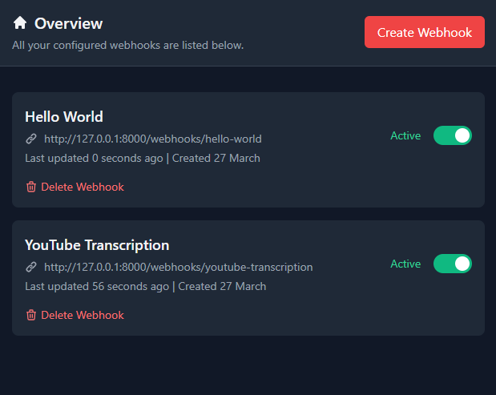

# 🚀 Python-Webhooks: Bridge the Gap Between AI and Python Libraries



> **⚠️ Project Status: In Development**  
> While functional, this project is actively being developed. Bug fixes and UX enhancements are in progress. Your contributions are welcome!

## 🤖 Embrace the AI Revolution

Python-Webhooks is your gateway to seamlessly connecting powerful Python libraries with modern AI automation tools. Born in the age of AI, this project was crafted to bridge the gap between established Python ecosystems and emerging AI agents.

### Key Features

- 🔌 **Instant Integration**: Transform any Python script into a webhook endpoint
- 🔍 **Smart Parameter Detection**: Automatically detects and exposes script parameters (if you use ArgumentParser)
- 🎯 **Developer Focused**: Clean API with detailed error messages
- 🧠 **AI-Ready**: Built with AI automation in mind, perfect for tools like n8n and Make.com

## ⚠️ Security Notice

This project executes Python scripts on your host machine. While this provides immense flexibility, it also comes with inherent security risks. Therefore:

- 🔒 **Use in controlled environments only**
- 🌐 **Deploy only on local networks**
- ⚡ **Never expose to the public internet**
- 🔐 **Implement additional security measures for production use**

## 🚀 Getting Started

### Prerequisites

- PHP 8.1 or higher
- Python 3.10 or higher
- Composer
- Node.js and npm
- Git

### Installation

1. Clone the repository
```bash
git clone https://github.com/yourusername/python-webhooks.git
cd python-webhooks
```

2. Install PHP dependencies
```bash
composer install
```

3. Install and compile frontend assets
```bash
npm install
npm run dev
```

4. Set up your environment
```bash
cp .env.example .env
php artisan key:generate
```

5. Configure your Python path
Edit your `.env` file and set your Python path:
```env
PYTHON_PATH=C:\\Python310\\python.exe  # Windows
# PYTHON_PATH=/usr/bin/python3         # Linux/Mac
```

6. Set up the database
```bash
php artisan migrate
```

### Running the Application

1. Start the development server
```bash
php artisan serve
```

2. Access the application
Open your browser and navigate to `http://localhost:8000`

### Creating Your First Webhook

1. Click "Create Webhook" in the dashboard
2. Give your webhook a name
3. Upload a Python script that uses `argparse` for parameters
4. Configure any required parameters
5. Save and get your webhook URL

### Example Python Script

```python
import argparse

parser = argparse.ArgumentParser(description='Example webhook script')
parser.add_argument('--name', help='Name to greet', required=True)
parser.add_argument('--greeting', help='Custom greeting', default='Hello')

args = parser.parse_args()
print(f"{args.greeting}, {args.name}!")
```

### Testing Your Webhook

Once created, you can test your webhook using curl or any HTTP client:

```bash
curl -X POST "http://localhost:8000/webhooks/your-webhook-url" \
     -H "Content-Type: application/json" \
     -d '{"name": "World"}'
```

## 🤝 Contributing

We're building something special here, and your contributions can make it even better! Here's how you can help:

1. Fork the repository
2. Create your feature branch (`git checkout -b feature/AmazingFeature`)
3. Commit your changes (`git commit -m 'Add some AmazingFeature'`)
4. Push to the branch (`git push origin feature/AmazingFeature`)
5. Open a Pull Request

### Priority Areas for Contribution

- 🎨 UX Enhancements
- 🐛 Bug Fixes
- 📚 Documentation
- 🧪 Test Coverage
- 🔒 Security Features

## 🤝 Support & Contact

Having questions or ideas? Want to discuss potential use cases? Feel free to:

- 📧 Reach out for inquiries and questions
- 🐛 Open an issue for bug reports
- 💡 Start a discussion for feature requests

## ⚡ Powered by AI

This project was developed with the assistance of AI, showcasing the potential of human-AI collaboration in creating developer tools.

## 📜 License

[License information coming soon...]

---

*Built with ❤️ for the AI-powered future of development*
